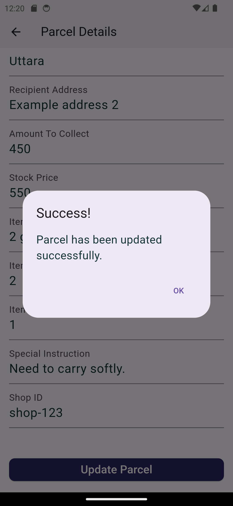

# Courier Management System
# Feature

1. Login to his/her account.
2. See all the parcels.
3. Create new parcels.
4. Update the parcels.
5. Search parcels by recipientName, recipientPhone, city etc. (All the available
   search query params are given in the postman)
6. Users can see details of a parcel on a separate screen.
Additional
7. Network checking
8. Loader
9. Launcher icon
10. Splash Page

# Dependencies used
cupertino_icons: ^1.0.2
get: ^4.6.1
intl: ^0.19.0
get_storage: ^2.0.3
http: ^1.2.0
pull_to_refresh: ^2.0.0
fluttertoast: ^8.0.8
connectivity_plus: ^5.0.2
flutter_launcher_icons: ^0.13.0
flutter_easyloading: ^3.0.5
internet_connection_checker: ^1.0.0+1

# Technology:
Flutter with Dart and state management GetX

